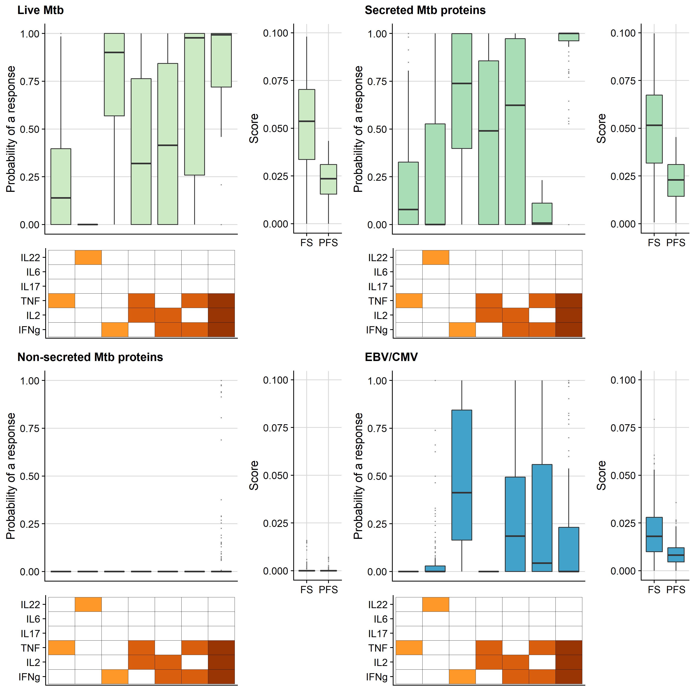

<!-- README.md is generated from README.Rmd. Please edit that file -->

```{r, include = FALSE}
knitr::opts_chunk$set(
  collapse = TRUE,
  comment = "#>",
  fig.path = "man/figures/README-",
  out.width = "100%"
)
```

# compassutils

<!-- badges: start -->
<!-- badges: end -->

The goal of compassutils is to supply useful plotting and utility functions for working with output from COMPASS. 

## Installation

You can install the latest version of compassutils from [GitHub](https://www.github.com) with 

```{r , eval = FALSE}
if(!require("devtools", quietly = TRUE)) install.packages('devtools')
devtools::install_github("SATVILab/compassutils.git")
```

## Example

### Plots

You can create boxplots of posterior probabilities for individual cytokine combinations, as well
as the PFS and FS responses. These are more concise than standard `COMPASS` heatmaps and automatically force the same cytokine combinations to be present and cytokines in the same order for all "groups" plotted together. Note that the PFS and FS scores plot need not be added.

```{r example-plot_compass, results = 'asis'}
library(compassutils)
data('c_obj_list', package = 'compassutils')
plot_compass(
  c_obj = c_obj_list, 
  type = c('pp', 'scores'),
  return_plot_list = FALSE, 
  shift_plot_scores = c(-0.05, 0.05), 
  shift_plot_pp_y = -0.075, 
  shift_plot_grid_x = 0.052
  )

```

### Utilities

You can convert cytokine combination formats between standard "+/-" format and COMPASS "!&" format. 
```{r , results = 'asis'}
cyt_combn_vec_compass <- c("IFNg&!IL2&TNF&IL6&!IL22",
                           "IFNg&IL2&TNF&IL6&IL22",
                           "!IFNg&!IL2&!TNF&!IL6&!IL22")
cyt_combn_vec_std <- compassutils::convert_cyt_combn_format(cyt_combn_vec_compass, 
                                                            to = 'std')
pander::pandoc.table(tibble::tibble(
  `COMPASS format` = cyt_combn_vec_compass, 
  `Standard format` = cyt_combn_vec_std 
  ))
```

