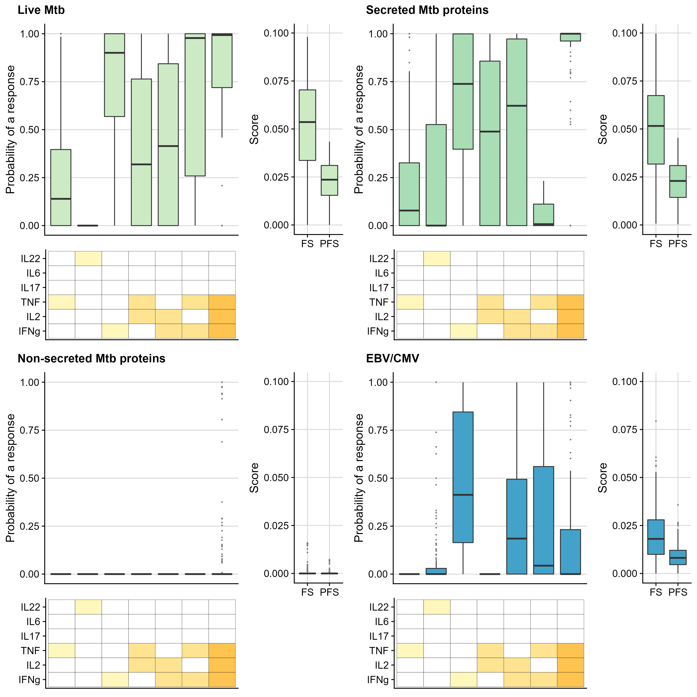
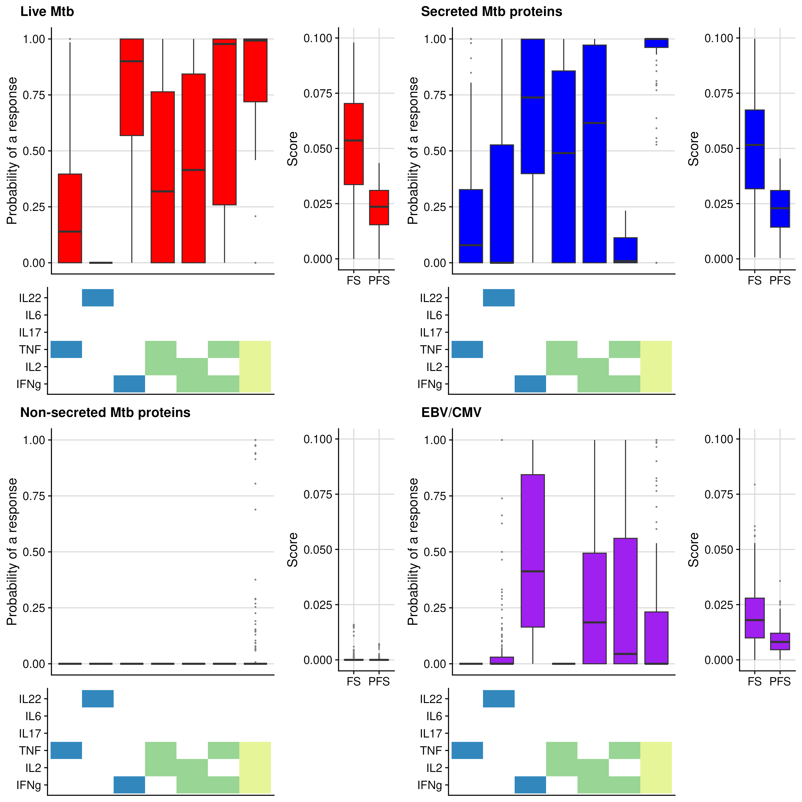

# UtilsCompassSV

The goal of UtilsCompassSV is to supply useful plotting and utility
functions for working with output from COMPASS.

## Installation

You can install the latest version of UtilsCompassSV from
[GitHub](https://www.github.com) with

``` r
if (!require("remotes", quietly = TRUE)) install.packages("remotes")
remotes::install_github("SATVILab/UtilsCompassSV")
```

## Example

### Plots

Create boxplots of posterior probabilities for individual cytokine
combinations, as well as the PFS and FS responses. These are more
concise than standard `COMPASS` heatmaps and automatically force the
same cytokine combinations to be present and cytokines in the same order
for all “groups” plotted together. Note that the PFS and FS scores plot
need not be added.

``` r
library(UtilsCompassSV)
data('c_obj_list', package = 'UtilsCompassSV')
plot_compass(
  c_obj = c_obj_list,
  dir_save = here::here('data-raw'),
  type = c('pp', 'scores'),
  return_plot_list = FALSE,
  shift_plot_scores = c(-0.05, 0.05),
  shift_plot_pp_y = -0.075,
  shift_plot_heatmap_x = 0.052
  )

```


Colours of boxplots and tiles in the cytokine grid plot can be
customized.

``` r
plot_compass(
  c_obj = c_obj_list,
  dir_save = here::here('data-raw'),
  file_grid = "compass_boxplots_grid_custom_colours",
  type = c('pp', 'scores'),
  return_plot_list = FALSE,
  shift_plot_scores = c(-0.05, 0.05),
  shift_plot_pp_y = -0.075,
  shift_plot_heatmap_x = 0.034,
  plot_prob_fill = c("skyblue", "forestgreen", "mediumvioletred", "darkorange"),
  tile_fill = RColorBrewer::brewer.pal(n = 11, name = "Spectral")[2:4] |> rev()
)

```


### Utilities

Convert cytokine combination formats between standard “+/-” format and
COMPASS “!&” format. Can also label cytokines/markers.

``` r
cyt_combn_vec_compass <- c("IFNg&!IL2&TNF&IL6&!IL22",
                           "IFNg&IL2&TNF&IL6&IL22",
                           "!IFNg&!IL2&!TNF&!IL6&!IL22")
cyt_combn_vec_std <- UtilsCompassSV::convert_cyt_combn_format(cyt_combn_vec_compass,
                                                            to = 'std')
pander::pandoc.table(tibble::tibble(
  `COMPASS format` = cyt_combn_vec_compass,
  `Standard format` = cyt_combn_vec_std
  ))
```

|       COMPASS format       |    Standard format     |
|:--------------------------:|:----------------------:|
|  IFNg&!IL2&TNF&IL6&!IL22   | IFNg+IL2-TNF+IL6+IL22- |
|   IFNg&IL2&TNF&IL6&IL22    | IFNg+IL2+TNF+IL6+IL22+ |
| !IFNg&!IL2&!TNF&!IL6&!IL22 | IFNg-IL2-TNF-IL6-IL22- |

Calculate the probability of an individual responding to at least one
cytokine combination, assuming independence of the probability estimates
between cytokine combinations.

``` r
response_prob(c_obj = c_obj_list[[4]]) %>%
  head() %>%
  pander::pandoc.table()
```

|  sampleid   |  prob  |
|:-----------:|:------:|
|  010673_D0  | 0.076  |
|  010782_D0  | 0.4405 |
| 010782_D720 | 0.903  |
|  010978_D0  |   1    |
|  010993_D0  | 0.8039 |
|  020185_D0  |   0    |
